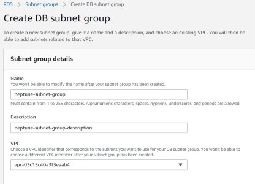

**Add a cover photo like:**


# New post title here

## Introduction

✍️ I want to find a way to create a book recommendation tool/app. In this lab I will explore how Amazon Neptune works. This will be my first attempt and test on how Neptune works. 

## Prerequisite

✍️ In this lab I will create a Amazon Neptune database and run queries against it from an EC2 instance.

## Use Case

- 🖼️ Use Jupyter notebooks to model data for Amazon Neptune
- ✍️ Create a Neptune cluster

## Cloud Research

- ✍️ This is an initial lab on Amazon Neptune
- 🖼️ Get deeper knowledge by watching and following along with [Getting Started with Amazon Neptune](https://pages.awscloud.com/AWS-Learning-Path-Getting-Started-with-Amazon-Neptune_2020_LP_0009-DAT.html) from AWS Online Tech Talks.

## Try yourself

✍️ When creating a DB in a VPC, you must select a DB subnet group. You can create an RDS Subnet Group using the RDS launch wizard.

### Step 1 — Create an RDS Subnet Group



### Step 2 — Create a Security Group for Neptune cluster

I will use an EC2 Instance to run queries against the Neptune database. In order to allow incoming traffic add an Ingress rule on port **8182** for that instances IP


### Step 3 — Launch Amazon Neptune Database

Use the **Development and Testing** template with burstable instance class, create read replica in different zone. Use the security group created in step two and uncheck **Create notebook** checkbox. 


:exclamation: The creation process might take up to 10-12 minutes to complete.

### Step 4 — Use Systems Manager to start a session 

I'm using an EC2 Instance to connect to the Neptune cluster, in order to do that I use Session Manager to start a browser-based Linux shell.


### Step 5 — Connect to Neptune cluster and run queries

Back in Neptune dashboard, under **Connectivity & security** copy the **Writer endpoint**. In the bash shell run command to set the Neptune endpoint:

```
ENDPOINT=https://<your-neptune-endpoint>:8182/sparql
```

Enter the following SPARQL command to insert a singleton in the graph database:

```
curl -X POST --data-binary 'update=INSERT DATA { <https://example.com/subject> <https://example.com/predicate> <https://example.com/object> . }' $ENDPOINT
```

## ☁️ Cloud Outcome

✍️ This very simple lab gave me a chance to properly set-up a Neptune cluster and run first query against it using SPARQL

## Next Steps

✍️ I need to watch the  [Getting Started with Amazon Neptune](https://pages.awscloud.com/AWS-Learning-Path-Getting-Started-with-Amazon-Neptune_2020_LP_0009-DAT.html) and learn more about SPARQL in order to be able to continue on this path.

## Social Proof

✍️ [Cloudofthings.net](https://cloudofthings.net/)

[link](link)
