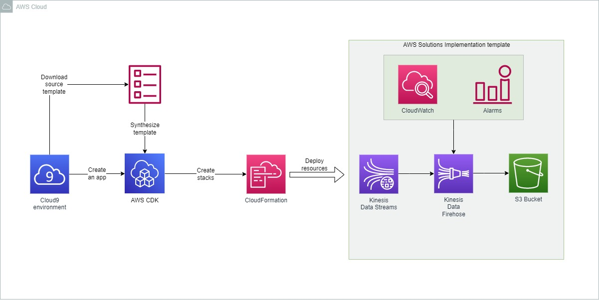
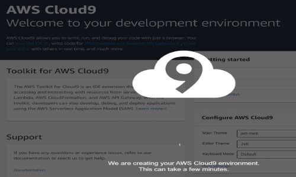
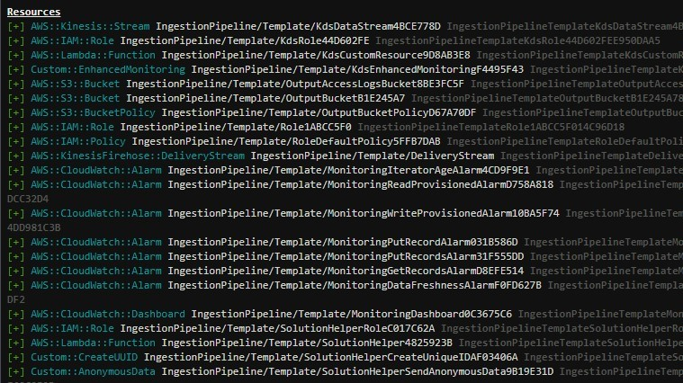
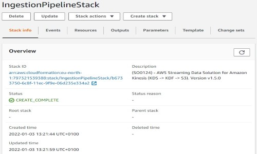

# [Build Your Infrastructure with AWS CloudFormation and the AWS CDK](https://build-infra-cfn-cdk.workshop.aws/en/)

## Introduction

✍️ This is a AWS official Workshop. Part I

This AWS CloudFormation template deploys a reference architecture that includes:

1. [Amazon Kinesis](https://aws.amazon.com/kinesis/data-streams/) Data Streams, which stores the incoming streaming data
2. [Amazon Kinesis Data Firehose](https://aws.amazon.com/kinesis/data-firehose/?kinesis-blogs.sort-by=item.additionalFields.createdDate&kinesis-blogs.sort-order=desc), which buffers the data before delivering the output to an Amazon S3 bucket. It is a fully managed service that automatically scales to match the throughput of your data and requires no ongoing administration.
3. An [Amazon CloudWatch](https://aws.amazon.com/cloudwatch/) dashboard monitors the data ingestion and buffering. CloudWatch alarms are set on essential metrics for Kinesis Data Firehose.

For purposes of the workshop, we’ll simulate a customer-facing app with a simple containerized application that will stream data into the ingestion pipeline.

## Prerequisite

✍️ AWS Account

## Use Case

- 🖼️ Streaming Data for Amazon Kinesis (SampleProducer is a Java application that uses the [Kinesis Producer Library](https://docs.aws.amazon.com/streams/latest/dev/developing-producers-with-kpl.html) to send messages at a configurable rate for a configurable duration in seconds.

  We’ll build this application into a Docker container, push it to the [Elastic Container Registry (ECR)](https://aws.amazon.com/ecr/) so it can be deployed to Fargate containers)

- ✍️ 

## Cloud Research

- ✍️ The AWS Solution Implementation library has several solutions for [Streaming Data for Amazon Kinesis](https://aws.amazon.com/solutions/implementations/aws-streaming-data-solution-for-amazon-kinesis/?did=sl_card&trk=sl_card), and Option 3 has just the solution that will accelerate our use case.
- 🖼️ [aws-samples/amazon-kinesis-data-processor-aws-fargate](https://github.com/aws-samples/amazon-kinesis-data-processor-aws-fargate)

## Try yourself

✍️ 

### Step 1 — Create an Cloud9 environment

Log in to your AWS account ant then navigate to Cloud9 and create an environment.



Then make sure that environment has the latest Node version by running:

```
nvm install v14.17.6
```

### Step 2 — Initialize the CDK Project

Create a new folder and initialize the AWS CDK CLI to create a project:

```
mkdir streaming-app && cd streaming-app
npx cdk@1.125.0 init --language=typescript ap
```

Then install AWS dependencies

```
npm install
```

In order to deploy our CDK application we first need to bootstrap our account.

```
npx cdk bootstrap
```

### Step 3 — Download and review the CloudFormation template

Run the following command:

```
mkdir templates
curl https://solutions-reference.s3.amazonaws.com/aws-streaming-data-solution-for-amazon-kinesis/v1.5.0/aws-streaming-data-solution-for-kinesis-using-kinesis-data-firehose-and-amazon-s3.template -o templates/aws-kinesis-streaming-solution.json
```


### Step 4 — Create resources from template in CDK application

Create a new file for our ingestion pipeline construct.

```
touch lib/ingestion-pipeline.ts
```

And use the following code:

```
import * as cdk from '@aws-cdk/core';
import * as include from '@aws-cdk/cloudformation-include';

import * as path from 'path';

export class IngestionPipeline extends cdk.Construct {
  constructor(scope: cdk.Construct, id: string) {
    super(scope, id);

    const template = new include.CfnInclude(this, 'Template', {
      templateFile: path.join(__dirname, '../templates/aws-kinesis-streaming-solution.json'),
      parameters: {
        ShardCount: 2,
        RetentionHours: 24,
        EnableEnhancedMonitoring: 'false',
        BufferingSize: 5,
        CompressionFormat: 'GZIP',
      },
      preserveLogicalIds: false,
    });
    
  }
}
```

Create a CDK Stack that will allow us to deploy the infrastructure.

```
touch lib/ingestion-pipeline-stack.ts
```

```
import * as cdk from '@aws-cdk/core';
import { IngestionPipeline } from './ingestion-pipeline';

export class IngestionPipelineStack extends cdk.Stack {
  constructor(scope: cdk.Construct, id: string, props?: cdk.StackProps) {
    super(scope, id, props);

    new IngestionPipeline(this, 'IngestionPipeline');
  }
}
```

Now add the stack to our entry point, and make sure to update the env parameter for both stacks.

Edit bin/streaming-app.ts

```
#!/usr/bin/env node
import 'source-map-support/register';
import * as cdk from '@aws-cdk/core';
import { StreamingAppStack } from '../lib/streaming-app-stack';
import { IngestionPipelineStack } from '../lib/ingestion-pipeline-stack';

const app = new cdk.App();
new IngestionPipelineStack(app, 'IngestionPipelineStack', {
  env: {
    account: process.env.CDK_DEFAULT_ACCOUNT,
    region: process.env.CDK_DEFAULT_REGION,
  },
});
new StreamingAppStack(app, 'StreamingAppStack', {
  env: {
    account: process.env.CDK_DEFAULT_ACCOUNT,
    region: process.env.CDK_DEFAULT_REGION,
  },
});
```

### Step 5 — Deploy resources

Run following command to see what will be deployed

```
npx cdk diff
```



run `cdk deploy` to create the ingestion pipeline.

```
npx cdk deploy --all
```

This will create the resources for the ingestion pipeline stack



And additional stack called **StreamingAppStack** that will be build in next steps.

### Step 6 — Build the streaming application with the CDK

The ingestion pipeline needs data to ingest. Create our streaming producer application that will stream data into our ingestion pipeline. 

```
touch lib/streaming-producer.ts
```

Paste the following code:

```
import * as cdk from '@aws-cdk/core';

export class StreamingProducer extends cdk.Construct {
  constructor(scope: cdk.Construct, id: string) {
    super(scope, id);

    // The code that defines your construct goes here
  }
}
```

## ☁️ Cloud Outcome

✍️ I learn what AWS Cloud Development Kit (CDK) is and how it can be used with CloudFormation

:exclamation: In order to create a streaming producer component I needed a Kinesis Producer Library Dockerfile which wasn't provided with the workshop - here I paused the Workshop by downloading the environment locally.

## Next Steps

✍️ In next part I will try to implement the KPL to simulate data streams.

## Social Proof

✍️ [Cloudofthings.net](https://cloudofthings.net/)

[link](link)
