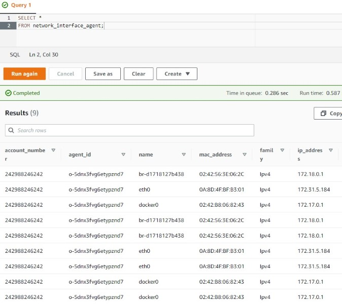

# [Preparing to Migrate Servers with the Application Discovery Service](https://cloudacademy.com/lab/preparing-server-migration-using-aws-application-discovery-service/?context_id=2654&context_resource=lp)

## Introduction

✍️ In this lab, you will install the AWS Application Discovery Agent on an EC2 server.

## Prerequisite

* AWS Account
* Running EC2 Instance
* You will need Access Key and secret key for your user to run Application Discovery Agent

## Use Case

- 🖼️ Migration of servers

- ✍️ 

## Cloud Research

- ✍️ [Preparing to Migrate Servers with the Application Discovery Service](https://cloudacademy.com/lab/preparing-server-migration-using-aws-application-discovery-service/?context_id=2654&context_resource=lp)
- 🖼️ 

## Try yourself

### Step 1 — Connect to an EC2 instance using EC2 Instance Connect

If you don't have an EC2 instance running, start one. Then connect to it using EC2 instance connect. 

### Step 2 — Install the AWS Application Discovery Agent

1. To list access keys for a specific user, in the Linux shell, enter the following command:

   ```
   aws iam list-access-keys --user <YOUR-USER-NAME>
   ```

   When running the AWS Application Discovery Agent, it is required to supply an access key of a user that has permission to use the AWS Application Discovery Service. Make a note of the value of the `AccessKeyId` field and store it somewhere you can easily retrieve it.

2. To download an archived AWS Application Discovery Agent, In the Linux shell, enter the following command

   ```
   wget https://clouda-labs-assets.s3-us-west-2.amazonaws.com/application-discovery/aws-discovery-agent.tar.gz
   ```

   To extract

   ````
   tar -xzf aws-discovery-agent.tar.gz
   ````

   To install it

   ```
   sudo bash install -r us-west-2 -k <YOUR-ACCESS-KEY-ID> -s <YOUR-SECRET-ACCESS-KEY>
   ```

   

3. To verify that agent is running, enter the following command:

   ```
   sudo systemctl status aws-discovery-daemon.service
   ```

   

4. In the AWS Management Console navigate to **Migration Hub**. Then **Data Collectors** and choose you current region. Then choose **Agents** tab and refresh. 

   

5. To start collecting data from this agent, click the check-box next to the **Agent ID**, and click **Start data collection**.

### Step 3 — Use Athena to run queries

1. Run queries on the data logged in Application Discovery Service destination bucket. To see the processes of the sample legacy application, enter the following SQL query:

   ```
   SELECT *
   FROM processes_agent
   WHERE cmd_line LIKE 'python3 %';
   ```

   

2. To see information about network interfaces, replace the current SQL query the following:

   ```
   SELECT *
   FROM network_interface_agent;
   ```

   

## ☁️ Cloud Outcome

* I learned how to start Application Discovery Service with agent and Migration Hub. Then I did some sample Athena queries on the data in S3.

## Next Steps

✍️ Implement this solution in real life.

✍️ [Cloudofthings.net](https://cloudofthings.net/)

[link](link)
