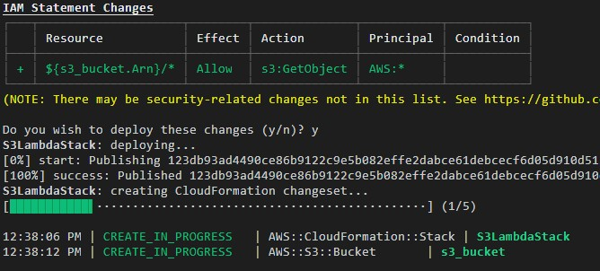

# [Defining Cloud Infrastructure with the AWS Cloud Development Kit and Python](https://cloudacademy.com/lab/getting-started-aws-cloud-development-kit-python/?context_id=3576&context_resource=lp)

## Introduction


## Prerequisite

* AWS Account
* AWS credentials configured on your local machine

## Use Case

- 

- 

## Cloud Research

- [AWS CDK Role Construct (Python)](https://docs.aws.amazon.com/cdk/api/latest/python/aws_cdk.aws_iam/Role.html)
- [AWS CDK Function Construct (Python)](https://docs.aws.amazon.com/cdk/api/latest/python/aws_cdk.aws_lambda/Function.html)
- [AWS CDK Bucket Construct (Python)](https://docs.aws.amazon.com/cdk/api/latest/python/aws_cdk.aws_s3/Bucket.html)

## Try yourself

### Step 1 — Create a new CDK project

Create a project folder and change directories into. In terminal run the following command:

```
cdk init app --language=python
```

his command initializes an empty AWS CDK Python project in the directory. Open the `app.py` and replace it with the following code:

```
#!/usr/bin/env python3
import os
         
from aws_cdk import core as cdk
from s3lambda.s3lambda_stack import S3LambdaStack
         
app = cdk.App()
S3LambdaStack(app, "S3LambdaStack")
         
app.synth()
```

Replace the contents of `s3lambda_stack.py` with the following:

```
from aws_cdk import (
    core as cdk,
    aws_iam as _iam,
    aws_lambda as _lambda,
    aws_s3 as _s3
)
         
class S3LambdaStack(cdk.Stack):
    def __init__(self, scope: cdk.Construct, construct_id: str, **kwargs) -> None:
        super().__init__(scope, construct_id, **kwargs)
        
        # use an existing IAM Role
        lambda_role = _iam.Role.from_role_arn(self, "role", 
                            "arn:aws:iam::621721782462:role/LambdaBasicRole", 
                            mutable=False)
         
        # create s3 bucket
        bucket = _s3.Bucket(self, "s3_bucket",
                            access_control=_s3.BucketAccessControl.PUBLIC_READ_WRITE,
                            public_read_access=True)
         
        # create lambda function
        function = _lambda.Function(self, "lambda_function",
                                    runtime=_lambda.Runtime.PYTHON_3_7,
                                    handler="lambda-handler.main",
                                    code=_lambda.Code.asset("./lambda"),
                                    role=lambda_role,
                                    environment={
                                        'bucket_name': bucket.bucket_name
                                    })
```

### Step 2 — Use CDK resource constructs

To activate your Python virtual environment, enter the following in the terminal:

```
source .venv/bin/activate
```

To install your Python dependencies in your virtual environment, run the following in the terminal:

```
pip install -r requirements.txt
```

To install your resource construct dependencies, enter the following in the terminal:

```
python -m pip install aws-cdk.aws-s3==1.117.0 aws-cdk.aws-lambda==1.117.0
```


### Step 3 — Create Lambda function

In the project folder create a new folder and a `lambda-handler.py` file with the following code

```
import os
import boto3
         
def main(event, context):
    # Print event to logs
    print(event)
    
    s3 = boto3.client('s3')
    bucket_name = os.environ['bucket_name']
    
    response = s3.put_object(
        Bucket=bucket_name,
        Key='sample-object',
        Body='Sample Text'
    )
     
    return {
        'statusCode': 200,
        'body': response
    }
```

### Step 4 — Use CDK Toolkit to synthesize and deploy stack

In the terminal window, enter the following:

```
cdk bootstrap
```

The `cdk bootstrap` command will deploy a CloudFormation stack named **CDKToolkit** to the AWS account using your credentials.

To synthesize a CloudFormation template, enter the following in the terminal:

``` 
cdk synth
```

Under the project directory to the left, double-click the `cdk.out/S3LambdaStack.template.json` file to open it in the code editor.

To deploy this AWS CloudFormation template, enter the following in the terminal:

```
cdk deploy
```



As an additional check, enter the following command in the terminal to verify your S3 bucket was created:

```
aws s3 ls
```


## ☁️ Cloud Outcome


## Next Steps

[Cloudofthings.net](https://cloudofthings.net/)

[link](link)
